

# 🏗️ Enterprise AI Platform — Architecture Reference

### *A Principal/Staff Engineer's Complete System Design*

> **Production-grade architecture for an Enterprise AI Platform featuring Hybrid RAG, Agentic AI with LangGraph, Spring Boot Microservices, Kubernetes, Kafka Event Sourcing, Multi-Tenant Security, and Full Observability.**

---

## 📋 Table of Contents

| Volume | Title | Focus Area |
|--------|-------|------------|
| [Volume 1](#volume-1--executive-architecture-level-0) | Executive Architecture | High-level system overview |
| [Volume 2](#volume-2--kubernetes--infrastructure) | Kubernetes and Infrastructure | Cluster topology, service mesh, observability infra |
| [Volume 3](#volume-3--spring-boot-microservice-architecture) | Spring Boot Microservices | 25+ microservices with REST + Kafka |
| [Volume 4](#volume-4--kafka-event-flow) | Kafka Event Flow | Document ingestion and query event streams |
| [Volume 5](#volume-5--hybrid-rag-pipeline) | Hybrid RAG Pipeline | End-to-end retrieval-augmented generation |
| [Volume 6](#volume-6--agentic-ai-platform-langgraph) | Agentic AI Platform | Multi-agent orchestration with LangGraph |
| [Volume 7](#volume-7--memory-architecture) | Memory Architecture | Short-term, semantic, episodic and long-term memory |
| [Volume 8](#volume-8--multi-tenant-security) | Multi-Tenant Security | OAuth, RBAC, ABAC, RLS, OPA, Vault |
| [Volume 9](#volume-9--monitoring--evaluation) | Monitoring and Evaluation | Prometheus, Grafana, RAGAS, DeepEval, LLM Judge |
| [Volume 10](#volume-10--cicd--mlops) | CI/CD and MLOps | GitHub Actions, ArgoCD, model versioning, A/B testing |

---

 

## Volume 1 — Executive Architecture Level 0

*High-level view of the entire Enterprise AI Platform*

```mermaid
%%{init: {'theme': 'dark'}}%%
flowchart TB

    subgraph CLIENTS["🌐 Client Layer"]
        direction LR
        WEB["🖥️ Web App - React/Next.js"]
        MOBILE["📱 Mobile App"]
        SLACK_C["💬 Slack Bot"]
        TEAMS_C["🟦 Teams Bot"]
        SDK_C["⚙️ REST/gRPC SDK"]
    end

    subgraph EDGE["🛡️ Edge Layer"]
        direction LR
        CDN["🌍 CDN - CloudFront"]
        WAF["🔥 WAF"]
        DDOS["🛡️ DDoS Protection"]
    end

    subgraph GATEWAY["🚪 API Gateway"]
        direction LR
        KONG["🦍 Kong/Spring Cloud GW"]
        RATELIMIT["⏱️ Rate Limiter"]
        CIRCUIT["🔌 Circuit Breaker"]
    end

    subgraph AUTH["🔐 Auth Layer"]
        direction LR
        AUTH_SVC["🔑 Keycloak/Auth0"]
        JWT["📜 JWT Validator"]
        RBAC_E["👤 RBAC Engine"]
        ABAC_E["🏷️ ABAC Engine"]
        TENANT_V["🏢 Tenant Validator"]
    end

    subgraph PLATFORM["🧠 Core AI Platform"]
        CONV["💬 Conversation Manager"]
        MEMORY["🧩 Memory System"]
        GUARD_IN["🛡️ Input Guardrails"]
        ROUTER["🔀 Conditional Router"]
        SMALL_LLM["⚡ Small LLM"]
        CALC["🧮 Calculator"]
        SQL_T["🗃️ SQL Tool"]
        PLANNER["📋 Planner"]
        TOOL_SEL["🔧 Tool Selector"]
        AGENT_COORD["🎯 Agent Coordinator"]
        AGENTS["🤖 AI Agents"]
        META_F["🏷️ Metadata Filter"]
        HYBRID_S["🔍 Hybrid Search"]
        RERANKER["📊 Reranker"]
        CTX_COMP["📦 Context Compression"]
        PROMPT_B["📝 Prompt Builder"]
        CITATION["📌 Citation Generator"]
        LLM_GW["🌐 LLM Gateway"]
        GROUND["✅ Grounding Check"]
        HALLU["🚨 Hallucination Detection"]
        RISK_CL["🎲 Risk Classifier"]
        AUTO_EX["⚡ Auto Execute"]
        HUMAN_AP["👨‍💼 Human Approval"]
    end

    subgraph TOOLS["🔧 Enterprise Tools"]
        direction LR
        T_EMAIL["📧 Email"]
        T_JIRA["📋 Jira"]
        T_SLACK["💬 Slack"]
        T_SQL["🗃️ Database"]
        T_AWS["☁️ AWS"]
        T_K8S["☸️ K8s"]
        T_CRM["👥 CRM"]
        T_ERP["🏭 ERP"]
    end

    subgraph STORAGE["💾 Data Layer"]
        direction LR
        PG[("🐘 PostgreSQL HA")]
        REDIS_S[("⚡ Redis Cluster")]
        VEC_DB[("🧬 Qdrant/Milvus")]
        ELASTIC[("🔍 Elasticsearch")]
        S3_S[("📦 S3/MinIO")]
        KAFKA_S[("📨 Kafka")]
    end

    subgraph INGEST["📥 Ingestion Pipeline"]
        direction LR
        DOC_UP["📄 Doc Upload"]
        PARSER["🔧 Parser - Tika"]
        OCR["👁️ OCR"]
        CHUNK["✂️ Chunker"]
        EMBED["🧬 Embedder"]
        INDEXER["📇 Indexer"]
    end

    subgraph OBSERVE["📊 Observability"]
        direction LR
        PROM["📈 Prometheus"]
        GRAF["📊 Grafana"]
        LOKI["📝 Loki"]
        JAEGER_O["🔗 Jaeger"]
        EVAL_ENG["🎯 RAGAS/DeepEval"]
        AUDIT["📋 Audit Trail"]
    end

    subgraph SECURITY["🔒 Security"]
        direction LR
        INJECT["💉 Injection Detection"]
        JAIL["🔓 Jailbreak Detection"]
        PII["🔐 PII Redaction"]
        GUARDRAILS["🛡️ NeMo Guardrails"]
    end

    CLIENTS --> EDGE
    EDGE --> GATEWAY
    GATEWAY --> AUTH
    AUTH --> PLATFORM
    PLATFORM --> TOOLS
    PLATFORM --> STORAGE
    INGEST --> STORAGE
    PLATFORM --> OBSERVE
    SECURITY --> PLATFORM
```

---

 

## Volume 2 — Kubernetes and Infrastructure

*Production Kubernetes cluster topology, service mesh, and infrastructure components*

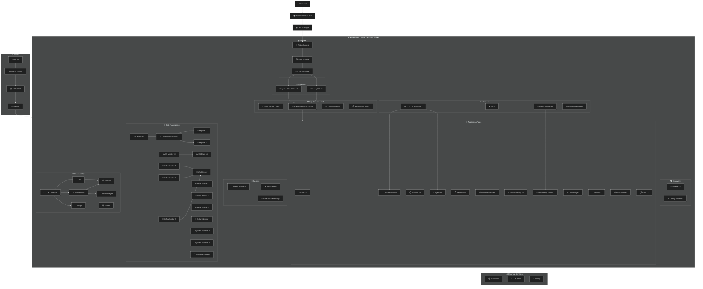

---

 

## Volume 3 — Spring Boot Microservice Architecture

*25+ Spring Boot microservices with REST and Kafka event communication*

```mermaid
%%{init: {'theme': 'dark'}}%%
flowchart TB

    subgraph INFRA["🌱 Spring Cloud Infra"]
        CONFIG["⚙️ Config Server"]
        EUREKA_S["📡 Eureka"]
        GW["🚪 API Gateway"]
        ADMIN_S["🖥️ Spring Boot Admin"]
    end

    subgraph AUTH_SVCS["🔐 Auth Services"]
        AUTH_S["🔑 Auth Service"]
        USER_S["👤 User Service"]
        TENANT_S["🏢 Tenant Service"]
        POLICY_S["📜 Policy Service - OPA"]
    end

    subgraph CONV_SVCS["💬 Conversation Services"]
        CONV_S["🗣️ Conversation Service"]
        MEM_S["🧩 Memory Service"]
        PROMPT_S["📝 Prompt Service"]
    end

    subgraph RAG_SVCS["📚 RAG Services"]
        RETRIEVAL_S["🔍 Retrieval Service"]
        SEARCH_S["🔎 Search Service"]
        RERANK_S["📊 Reranking Service"]
        CITE_S["📌 Citation Service"]
    end

    subgraph INGEST_SVCS["📥 Ingestion Services"]
        UPLOAD_S["📄 Upload Service"]
        PARSER_S["🔧 Parser Service"]
        OCR_S["👁️ OCR Service"]
        CHUNK_S["✂️ Chunking Service"]
        EMBED_S["🧬 Embedding Service"]
        META_S["🏷️ Metadata Service"]
        INDEX_S["📇 Index Service"]
    end

    subgraph AI_SVCS["🧠 AI Engine"]
        LLM_GW_S["🌐 LLM Gateway Service"]
        PLANNER_S["📋 Planner Service"]
        AGENT_S["🤖 Agent Service"]
        GUARD_S["🛡️ Guardrail Service"]
    end

    subgraph EVAL_SVCS["📊 Eval and Audit"]
        EVAL_S["🎯 Evaluation Service"]
        AUDIT_S["📋 Audit Service"]
        FEEDBACK_S["👍 Feedback Service"]
        ANALYTICS_S["📈 Analytics Service"]
    end

    subgraph OPS_SVCS["⚙️ Operations"]
        NOTIF_S["🔔 Notification Service"]
        SCHED_S["⏰ Scheduler Service"]
        WORK_S["🔄 Workflow Service"]
        BILL_S["💰 Billing Service"]
        ADM_S["🖥️ Admin Service"]
    end

    KAFKA_BUS{{"📨 Kafka Event Bus"}}

    PG_D[("🐘 PostgreSQL")]
    REDIS_D[("⚡ Redis")]
    VEC_D[("🧬 Qdrant")]
    ES_D[("🔍 Elasticsearch")]
    S3_D[("📦 S3")]

    GW --> AUTH_S
    GW --> CONV_S
    GW --> RETRIEVAL_S
    GW --> UPLOAD_S
    GW --> LLM_GW_S
    GW --> PLANNER_S
    GW --> AGENT_S
    GW --> ADM_S

    AUTH_S --> POLICY_S
    CONV_S --> MEM_S
    CONV_S --> PROMPT_S
    RETRIEVAL_S --> SEARCH_S
    RETRIEVAL_S --> RERANK_S
    RETRIEVAL_S --> CITE_S
    PLANNER_S --> AGENT_S
    AGENT_S --> LLM_GW_S
    AGENT_S --> RETRIEVAL_S
    PROMPT_S --> LLM_GW_S
    LLM_GW_S --> EVAL_S
    WORK_S --> AGENT_S

    UPLOAD_S --> KAFKA_BUS
    KAFKA_BUS --> PARSER_S
    KAFKA_BUS --> OCR_S
    KAFKA_BUS --> CHUNK_S
    KAFKA_BUS --> EMBED_S
    KAFKA_BUS --> META_S
    KAFKA_BUS --> INDEX_S
    KAFKA_BUS --> AUDIT_S
    KAFKA_BUS --> NOTIF_S

    AUTH_S --> PG_D
    CONV_S --> PG_D
    AUDIT_S --> PG_D
    BILL_S --> PG_D

    CONV_S --> REDIS_D
    MEM_S --> REDIS_D
    LLM_GW_S --> REDIS_D

    SEARCH_S --> VEC_D
    INDEX_S --> VEC_D
    SEARCH_S --> ES_D
    INDEX_S --> ES_D
    UPLOAD_S --> S3_D
```

---

 

## Volume 4 — Kafka Event Flow

*Complete event-driven architecture: Document Ingestion Stream*

```mermaid
%%{init: {'theme': 'dark'}}%%
flowchart TB

    USER_UP["📄 User Uploads Document"]

    subgraph UPLOAD["📤 Upload Phase"]
        VALIDATE["✅ Validate File"]
        STORE_S3["📦 Store in S3"]
        CREATE_REC["🗃️ Create Doc Record"]
    end

    USER_UP --> VALIDATE --> STORE_S3 --> CREATE_REC

    EVT1{{"📨 document.uploaded"}}
    CREATE_REC --> EVT1

    subgraph PARSE["🔧 Parsing Phase"]
        TIKA["🔧 Tika Parser"]
        TABLE_EX["📊 Table Extractor"]
        IMG_EX["🖼️ Image Extractor"]
    end

    EVT1 --> TIKA
    TIKA --> TABLE_EX
    TIKA --> IMG_EX

    EVT2{{"📨 document.parsed"}}
    TABLE_EX --> EVT2
    IMG_EX --> EVT2

    subgraph OCR_P["👁️ OCR Phase"]
        DETECT_S["🔍 Detect Scanned Pages"]
        RUN_OCR["👁️ Run OCR"]
        MERGE_T["🔗 Merge OCR + Text"]
    end

    EVT2 --> DETECT_S --> RUN_OCR --> MERGE_T

    EVT3{{"📨 document.ocr.completed"}}
    MERGE_T --> EVT3

    subgraph STRUCT["🏗️ Structure Detection"]
        DET_HEAD["📑 Detect Headers"]
        DET_LIST["📋 Detect Lists"]
        BUILD_TREE["🌳 Build Doc Tree"]
    end

    EVT3 --> DET_HEAD --> DET_LIST --> BUILD_TREE

    EVT4{{"📨 document.structured"}}
    BUILD_TREE --> EVT4

    subgraph CHUNKING["✂️ Chunking Phase"]
        SEL_STRAT["🎯 Select Strategy"]
        REC_CHUNK["📄 Recursive Splitting"]
        SEM_CHUNK["🧠 Semantic Chunking"]
        AGENT_CHUNK["🤖 Agentic Chunking"]
        PARENT_LINK["🔗 Parent-Child Linking"]
    end

    EVT4 --> SEL_STRAT
    SEL_STRAT --> REC_CHUNK
    SEL_STRAT --> SEM_CHUNK
    SEL_STRAT --> AGENT_CHUNK
    REC_CHUNK --> PARENT_LINK
    SEM_CHUNK --> PARENT_LINK
    AGENT_CHUNK --> PARENT_LINK

    EVT5{{"📨 document.chunked"}}
    PARENT_LINK --> EVT5

    subgraph METADATA["🏷️ Metadata Generation"]
        AUTO_TAG["🏷️ Auto-Tagging"]
        NER["🔍 Entity Extraction"]
        LANG_DET["🌐 Language Detection"]
        DEPT_CL["🏢 Department Classification"]
        ACL_ASS["🔐 ACL Assignment"]
    end

    EVT5 --> AUTO_TAG --> NER --> LANG_DET --> DEPT_CL --> ACL_ASS

    EVT6{{"📨 document.metadata.generated"}}
    ACL_ASS --> EVT6

    subgraph EMBEDDING["🧬 Embedding Phase"]
        BATCH_C["📦 Batch Chunks"]
        GEN_EMB["🧬 Dense Embeddings"]
        SPARSE_E["📊 Sparse Embeddings"]
        QUALITY_C["✅ Quality Check"]
    end

    EVT6 --> BATCH_C
    BATCH_C --> GEN_EMB
    BATCH_C --> SPARSE_E
    GEN_EMB --> QUALITY_C
    SPARSE_E --> QUALITY_C

    EVT7{{"📨 document.embedded"}}
    QUALITY_C --> EVT7

    subgraph INDEXING["📇 Multi-Index Write"]
        W_VECTOR["🧬 Write Vector DB"]
        W_ELASTIC["🔍 Write Elasticsearch"]
        W_PG["🐘 Write PostgreSQL"]
    end

    EVT7 --> W_VECTOR
    EVT7 --> W_ELASTIC
    EVT7 --> W_PG

    EVT8{{"📨 document.indexed"}}
    W_VECTOR --> EVT8
    W_ELASTIC --> EVT8
    W_PG --> EVT8

    subgraph FINALIZE["✅ Finalization"]
        CACHE_INV["⚡ Invalidate Cache"]
        SEND_NOTIF["🔔 Send Notification"]
        FINAL_ST["🗃️ Status: READY"]
    end

    EVT8 --> CACHE_INV
    EVT8 --> SEND_NOTIF
    CACHE_INV --> FINAL_ST
    SEND_NOTIF --> FINAL_ST

    subgraph ERRORS["❌ Error Handling"]
        DLQ["☠️ Dead Letter Queue"]
        RETRY["🔄 Retry - Exp Backoff"]
        ALERT_OP["🚨 Alert Operations"]
    end

    EVT1 -.->|Failure| DLQ
    EVT5 -.->|Failure| DLQ
    EVT7 -.->|Failure| DLQ
    DLQ --> RETRY
    RETRY -->|Max Retries| ALERT_OP
```

 

*Query Processing Event Stream*

```mermaid
%%{init: {'theme': 'dark'}}%%
flowchart TB

    USER_Q["💬 User Sends Query"]

    subgraph CONV_P["🗣️ Conversation Phase"]
        LOAD_SESS["📋 Load Session"]
        LOAD_MEM["🧩 Recall Memory"]
        GUARD_CHK["🛡️ Input Guardrails"]
    end

    USER_Q --> LOAD_SESS --> LOAD_MEM --> GUARD_CHK

    EVT_Q{{"📨 query.asked"}}
    GUARD_CHK --> EVT_Q

    subgraph ROUTE["🔀 Routing"]
        CLASSIFY["🎯 Classify Intent"]
        DECISION{"🔀 Route"}
        GREET["👋 Greeting"]
        MATH["🧮 Calculator"]
        SQL_R["🗃️ SQL"]
    end

    EVT_Q --> CLASSIFY --> DECISION
    DECISION -->|Greeting| GREET
    DECISION -->|Math| MATH
    DECISION -->|SQL| SQL_R
    DECISION -->|Knowledge| PLAN_P

    subgraph PLAN_P["📋 Planning"]
        DECOMP["🧩 Task Decomposition"]
        TOOL_S["🔧 Tool Selection"]
        BUILD_DAG["📊 Build DAG"]
    end

    DECOMP --> TOOL_S --> BUILD_DAG

    EVT_P{{"📨 query.plan.created"}}
    BUILD_DAG --> EVT_P

    subgraph RETRIEVAL["🔍 Retrieval"]
        Q_EXPAND["🔄 Query Expansion"]
        META_FIL["🏷️ Metadata Pre-filter"]
        BM25_S["📝 BM25 Search"]
        VEC_S["🧬 Vector Search"]
        SPLADE_S["📊 SPLADE Search"]
        RRF["🔗 RRF Merge"]
    end

    EVT_P --> Q_EXPAND --> META_FIL
    META_FIL --> BM25_S
    META_FIL --> VEC_S
    META_FIL --> SPLADE_S
    BM25_S --> RRF
    VEC_S --> RRF
    SPLADE_S --> RRF

    EVT_R{{"📨 query.retrieval.completed"}}
    RRF --> EVT_R

    subgraph RERANKING["📊 Reranking"]
        CROSS_E["🔄 Cross-Encoder"]
        DIVERSITY["🌈 MMR Diversity"]
        COMPRESS["📦 Context Compression"]
        TOP_K["🏆 Top-K Selection"]
    end

    EVT_R --> CROSS_E --> DIVERSITY --> COMPRESS --> TOP_K

    subgraph GEN["🧠 Generation"]
        BUILD_PR["📝 Build Prompt"]
        SEL_MODEL["🎯 Select LLM"]
        STREAM_R["⚡ Stream Response"]
        GEN_CITE["📌 Generate Citations"]
    end

    TOP_K --> BUILD_PR --> SEL_MODEL --> STREAM_R --> GEN_CITE

    EVT_G{{"📨 query.answer.generated"}}
    GEN_CITE --> EVT_G

    subgraph SELF_EVAL["🔄 Self-Correcting Eval"]
        CHK_GND["✅ Grounding Check"]
        CHK_FAI["🎯 Faithfulness"]
        CHK_HAL["🚨 Hallucination"]
        CONF_SC["📊 Confidence Score"]
        QUAL_GATE{"✅ Quality Gate"}
    end

    EVT_G --> CHK_GND --> CHK_FAI --> CHK_HAL --> CONF_SC --> QUAL_GATE

    subgraph RETRY_P["🔄 Retry"]
        REWRITE_Q["✏️ Rewrite Query"]
        RETRY_CT{"🔢 Retry Count"}
        FALLBACK["💬 Fallback Response"]
    end

    QUAL_GATE -->|Fail| REWRITE_Q
    REWRITE_Q --> RETRY_CT
    RETRY_CT -->|Retry| Q_EXPAND
    RETRY_CT -->|Max Reached| FALLBACK

    subgraph RESPONSE["📤 Response"]
        FORMAT_R["📝 Format Response"]
        STORE_M["🧩 Store Memory"]
        GUARD_OUT["🛡️ Output Guardrails"]
        SEND_R["📤 Send to User"]
    end

    QUAL_GATE -->|Pass| FORMAT_R
    FORMAT_R --> STORE_M --> GUARD_OUT --> SEND_R

    EVT_C{{"📨 query.completed"}}
    SEND_R --> EVT_C

    subgraph POST["📊 Post-Processing"]
        SAVE_AUD["📋 Save Audit"]
        UPD_USAGE["💰 Update Usage"]
        AWAIT_FB["👍 Await Feedback"]
    end

    EVT_C --> SAVE_AUD
    EVT_C --> UPD_USAGE
    EVT_C --> AWAIT_FB
```

---

 

## Volume 5 — Hybrid RAG Pipeline

*Advanced retrieval-augmented generation with multi-stage processing*

```mermaid
%%{init: {'theme': 'dark'}}%%
flowchart TB

    INPUT["💬 User Query"]

    subgraph UNDERSTAND["🧠 Query Understanding"]
        INTENT["🎯 Intent Detection"]
        NER_Q["🏷️ Named Entity Recognition"]
        COMPLEX["📊 Complexity Estimation"]
        MULTI_Q["📝 Multi-Query Generation"]
        HYDE_Q["🎭 HyDE - Hypothetical Doc"]
        STEP_B["🔙 Step-Back Prompting"]
        DECOMP_Q["🧩 Query Decomposition"]
    end

    INPUT --> INTENT --> NER_Q --> COMPLEX
    COMPLEX --> MULTI_Q --> HYDE_Q --> STEP_B --> DECOMP_Q

    subgraph PRE_FILTER["🏷️ Pre-Retrieval Filters"]
        TENANT_F["🏢 Tenant Isolation - RLS"]
        DEPT_F["🏛️ Department Filter"]
        ACL_F["🔐 ACL Enforcement"]
        VER_F["📊 Version Filter"]
        DATE_F["📅 Date Range"]
        COLL_F["📁 Collection Filter"]
    end

    DECOMP_Q --> TENANT_F --> DEPT_F --> ACL_F --> VER_F --> DATE_F --> COLL_F

    subgraph SEARCH["🔍 Hybrid Search Engine"]

        subgraph DENSE["🧬 Dense Path"]
            Q_EMBED["🧬 Query Embedding"]
            ANN["⚡ ANN Search - Qdrant"]
            MULTI_V["🔢 ColBERTv2"]
        end

        subgraph SPARSE["📝 Sparse Path"]
            BM25["📝 BM25 - Elasticsearch"]
            SPLADE["📊 SPLADE"]
        end

        subgraph KG["🕸️ Knowledge Graph"]
            KG_Q["🕸️ Graph Traversal"]
            KG_EXP["🔗 Relationship Expansion"]
        end

        subgraph FUSION["🔗 Fusion"]
            RRF_F["🔢 Reciprocal Rank Fusion"]
            WEIGHT_F["⚖️ Weighted Fusion"]
            DEDUP_F["🔄 Deduplication"]
        end
    end

    COLL_F --> Q_EMBED
    COLL_F --> BM25
    COLL_F --> SPLADE
    COLL_F --> KG_Q

    Q_EMBED --> ANN
    Q_EMBED --> MULTI_V
    KG_Q --> KG_EXP

    ANN --> RRF_F
    MULTI_V --> RRF_F
    BM25 --> RRF_F
    SPLADE --> RRF_F
    KG_EXP --> RRF_F

    RRF_F --> WEIGHT_F --> DEDUP_F

    subgraph RERANK["📊 Multi-Stage Reranking"]
        CE_R["🔄 Cross-Encoder Rerank"]
        COL_R["🎯 ColBERT Rerank"]
        LLM_R["🧠 LLM Rerank"]
        MMR_R["🌈 MMR Diversity"]
        NORM_R["📊 Score Normalize"]
    end

    DEDUP_F --> CE_R --> COL_R --> LLM_R --> MMR_R --> NORM_R

    subgraph CTX["📦 Context Processing"]
        PARENT_R["📑 Parent Chunk Retrieval"]
        CTX_WIN["📐 Context Window Mgmt"]
        CTX_CMP["📦 LLMLingua Compression"]
        CITE_MAP["📌 Citation Mapping"]
        TOPK["🏆 Top-5 Selection"]
    end

    NORM_R --> PARENT_R --> CTX_WIN --> CTX_CMP --> CITE_MAP --> TOPK

    subgraph PROMPT["📝 Prompt Engineering"]
        SYS_P["🖥️ System Prompt"]
        CTX_INJ["📚 Context Injection"]
        MEM_INJ["🧩 Memory Injection"]
        HIST_INJ["💬 History Injection"]
        COT["🔗 Chain-of-Thought"]
        FEW["📋 Few-Shot Examples"]
    end

    TOPK --> SYS_P --> CTX_INJ --> MEM_INJ --> HIST_INJ --> COT --> FEW

    subgraph LLM_GEN["🧠 LLM Generation"]
        MODEL_SEL["🎯 Dynamic Model Select"]
        TOKEN_CT["🔢 Token Estimation"]
        STREAM["⚡ Streaming SSE"]
        STRUCT_OUT["📋 Structured Output"]
    end

    FEW --> MODEL_SEL --> TOKEN_CT --> STREAM --> STRUCT_OUT

    subgraph POST_GEN["✅ Post-Generation"]
        ATT_CITE["📌 Attach Citations"]
        CONF["📊 Confidence Score"]
        FMT["📝 Format Output"]
        CACHE["⚡ Cache Response"]
    end

    STRUCT_OUT --> ATT_CITE --> CONF --> FMT --> CACHE

    FINAL["📤 Final Response + Citations"]
    CACHE --> FINAL

    QDRANT_D[("🧬 Qdrant")]
    ES_D2[("🔍 Elasticsearch")]
    NEO4J_D[("🕸️ Neo4j")]
    PG_D2[("🐘 PostgreSQL")]

    ANN -.-> QDRANT_D
    BM25 -.-> ES_D2
    KG_Q -.-> NEO4J_D
    TENANT_F -.-> PG_D2
```

---

 

## Volume 6 — Agentic AI Platform LangGraph

*Multi-agent orchestration with state graphs, tool use, and human-in-the-loop*

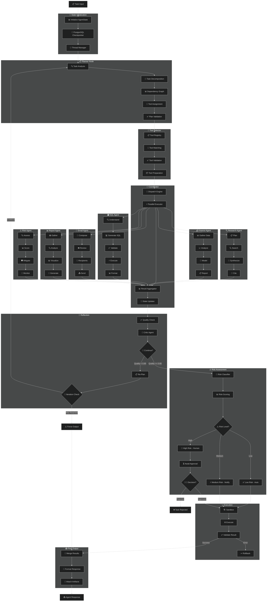

---

 

## Volume 7 — Memory Architecture

*Complete memory system: short-term, semantic, episodic, and long-term*

```mermaid
%%{init: {'theme': 'dark'}}%%
flowchart TB

    INTERACT["💬 User Interaction"]

    subgraph CONTROLLER["🧠 Memory Controller"]
        STORE_DEC["📋 Storage Decision"]
        RECALL_DEC["🔍 Recall Decision"]
        CONSOLIDATE["🔄 Consolidation"]
        FORGET["🗑️ Forgetting Engine"]
    end

    INTERACT --> STORE_DEC
    STORE_DEC --> RECALL_DEC --> CONSOLIDATE --> FORGET

    subgraph STM["⚡ Short-Term Memory"]
        SLIDING["📐 Sliding Window - Last 20 turns"]
        TOKEN_BUF["🔢 Token Buffer - Max 8K"]
        SUMMARY_BUF["📝 Summary Buffer"]
        CURRENT_Q["💬 Current Query"]
        WORKING_M["🧩 Working Memory"]
        ATTENTION["🎯 Attention Focus"]
    end

    STORE_DEC --> SLIDING
    STORE_DEC --> CURRENT_Q
    SLIDING --> SUMMARY_BUF
    TOKEN_BUF --> SUMMARY_BUF
    CURRENT_Q --> WORKING_M --> ATTENTION

    STM_DB[("⚡ Redis - TTL 2h")]
    SLIDING --> STM_DB

    subgraph CONV_MEM["💬 Conversation Memory"]
        FULL_HIST["📜 Full History"]
        META_ST["🏷️ Metadata Store"]
        BRANCH_ST["🔀 Branches"]
        TOPIC_IDX["📑 Topic Index"]
        ENTITY_IDX["🏷️ Entity Index"]
        TEMP_IDX["📅 Temporal Index"]
    end

    STORE_DEC --> FULL_HIST
    FULL_HIST --> TOPIC_IDX
    META_ST --> ENTITY_IDX
    BRANCH_ST --> TEMP_IDX

    CONV_DB[("🐘 PostgreSQL")]
    FULL_HIST --> CONV_DB

    subgraph SEM_MEM["🧬 Semantic Memory"]
        FACTS["📋 Learned Facts"]
        BELIEFS["💡 Beliefs and Opinions"]
        SKILLS_M["🔧 Procedural Knowledge"]
        EXTRACT_K["🔍 Knowledge Extraction"]
        EMBED_K["🧬 Embed Knowledge"]
        UPDATE_K["🔄 Update Knowledge"]
        DECAY_K["📉 Knowledge Decay"]
    end

    CONSOLIDATE --> EXTRACT_K
    FACTS --> EXTRACT_K
    BELIEFS --> EXTRACT_K
    SKILLS_M --> EXTRACT_K
    EXTRACT_K --> EMBED_K --> UPDATE_K --> DECAY_K

    SEM_DB[("🧬 Qdrant - Semantic")]
    EMBED_K --> SEM_DB

    subgraph EPIS_MEM["📸 Episodic Memory"]
        EPISODES["📸 Episodes"]
        OUTCOMES["📊 Outcomes"]
        EMOTION["💭 Emotional Context"]
        BOUND_DET["🔍 Boundary Detection"]
        EP_EMBED["🧬 Episode Embedding"]
        SIM_EP["🔗 Find Similar"]
        LEARN_EP["📚 Learn from Episodes"]
    end

    CONSOLIDATE --> BOUND_DET
    EPISODES --> BOUND_DET
    OUTCOMES --> BOUND_DET
    EMOTION --> BOUND_DET
    BOUND_DET --> EP_EMBED --> SIM_EP --> LEARN_EP

    EPIS_DB[("🧬 Qdrant - Episodic")]
    EP_EMBED --> EPIS_DB

    subgraph LTM["🏛️ Long-Term Memory"]
        USER_PROF["👤 User Profile"]
        DOMAIN_K["📖 Domain Knowledge"]
        INT_PAT["📊 Interaction Patterns"]
        REL_MAP["🔗 Relationship Map"]
        IMP_SCORE["📊 Importance Scoring"]
        SPACED["🔄 Spaced Repetition"]
        MEM_MERGE["🔗 Memory Merging"]
        PRIV_FILT["🔐 Privacy Filter"]
    end

    CONSOLIDATE --> IMP_SCORE
    USER_PROF --> IMP_SCORE
    DOMAIN_K --> IMP_SCORE
    INT_PAT --> IMP_SCORE
    REL_MAP --> IMP_SCORE
    IMP_SCORE --> SPACED --> MEM_MERGE --> PRIV_FILT

    LTM_PG[("🐘 PostgreSQL - LTM")]
    LTM_VEC[("🧬 Qdrant - LTM")]
    PRIV_FILT --> LTM_PG
    PRIV_FILT --> LTM_VEC

    subgraph RECALL["🔍 Memory Recall Pipeline"]
        Q_ANAL["🔍 Analyze Query"]
        PAR_REC["⚡ Parallel Recall"]
        STM_REC["⚡ STM Recall"]
        CONV_REC["💬 Conv Recall"]
        SEM_REC["🧬 Semantic Recall"]
        EPIS_REC["📸 Episodic Recall"]
        LTM_REC["🏛️ LTM Recall"]
        RANK_MEM["📊 Rank and Fuse"]
        CTX_ASM["📝 Assemble Context"]
    end

    RECALL_DEC --> Q_ANAL --> PAR_REC
    PAR_REC --> STM_REC
    PAR_REC --> CONV_REC
    PAR_REC --> SEM_REC
    PAR_REC --> EPIS_REC
    PAR_REC --> LTM_REC
    STM_REC --> RANK_MEM
    CONV_REC --> RANK_MEM
    SEM_REC --> RANK_MEM
    EPIS_REC --> RANK_MEM
    LTM_REC --> RANK_MEM
    RANK_MEM --> CTX_ASM

    MEM_OUT["🧩 Memory Context Output"]
    CTX_ASM --> MEM_OUT

    STM_REC -.-> STM_DB
    CONV_REC -.-> CONV_DB
    SEM_REC -.-> SEM_DB
    EPIS_REC -.-> EPIS_DB
    LTM_REC -.-> LTM_PG
    LTM_REC -.-> LTM_VEC
```

---

 

## Volume 8 — Multi-Tenant Security

*Enterprise security: OAuth, RBAC, ABAC, RLS, OPA, and Vault*

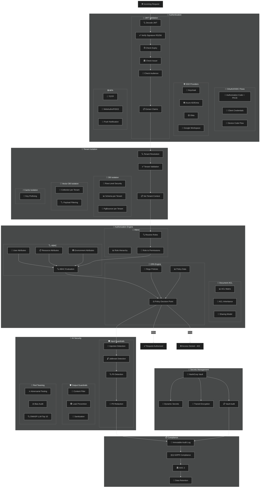

---

 

## Volume 9 — Monitoring and Evaluation

*Observability stack with Prometheus, Grafana, RAGAS, DeepEval, and LLM Judge*

```mermaid
%%{init: {'theme': 'dark'}}%%
flowchart TB

    subgraph SOURCES["🧠 Application Sources"]
        direction LR
        MICRO["🌱 Microservices"]
        KAFKA_SRC2["📨 Kafka"]
        LLM_CALLS2["🧠 LLM Calls"]
        RAG_SRC["📚 RAG Pipeline"]
        AGENT_SRC["🤖 Agents"]
    end

    subgraph OTEL["📡 OpenTelemetry"]
        JAVA_AG["☕ Java Agent"]
        PY_SDK["🐍 Python SDK"]
        CUST_MET["📊 Custom Metrics"]
        RECV["📥 Receivers"]
        PROC["⚙️ Processors"]
        EXPORT["📤 Exporters"]
    end

    MICRO --> JAVA_AG
    KAFKA_SRC2 --> JAVA_AG
    LLM_CALLS2 --> PY_SDK
    RAG_SRC --> PY_SDK
    AGENT_SRC --> PY_SDK
    JAVA_AG --> RECV
    PY_SDK --> RECV
    CUST_MET --> RECV
    RECV --> PROC --> EXPORT

    subgraph METRICS["📈 Metrics Pipeline"]
        PROM_S["📈 Prometheus"]
        SYS_M["🖥️ System Metrics"]
        APP_M["🌱 App Metrics"]
        AI_M["🧠 AI Metrics - tokens/latency/cost"]
        RAG_M["📚 RAG Metrics"]
        BIZ_M["💼 Business Metrics"]
        THANOS_S["🏔️ Thanos - Long Term"]
    end

    EXPORT --> PROM_S
    PROM_S --> THANOS_S

    subgraph LOGS["📝 Logging"]
        LOKI_S["📝 Loki"]
        ACCESS_L["🔗 Access Logs"]
        APP_L["🌱 App Logs"]
        AUDIT_L["📋 Audit Logs"]
        AI_L["🧠 AI Logs"]
        SEC_L["🔒 Security Logs"]
        LOG_ARCH["📦 S3 Archive"]
    end

    EXPORT --> LOKI_S
    LOKI_S --> LOG_ARCH

    subgraph TRACES["🔗 Tracing"]
        TEMPO_S["🔗 Tempo"]
        E2E_T["🔗 E2E Query Trace"]
        RAG_T["📚 RAG Trace"]
        AGENT_T["🤖 Agent Trace"]
        INGEST_T["📥 Ingestion Trace"]
        JAEGER_U["🔍 Jaeger UI"]
    end

    EXPORT --> TEMPO_S
    TEMPO_S --> JAEGER_U

    subgraph DASH["📊 Grafana Dashboards"]
        GRAF_S["📊 Grafana"]
        D_OVER["🏠 Overview"]
        D_LLM["🧠 LLM Performance"]
        D_RAG["📚 RAG Quality"]
        D_AGENT["🤖 Agent Monitoring"]
        D_TENANT["🏢 Tenant Analytics"]
        D_SEC["🔒 Security"]
        D_INFRA["☸️ Infrastructure"]
    end

    PROM_S --> GRAF_S
    LOKI_S --> GRAF_S
    TEMPO_S --> GRAF_S

    subgraph ALERTING["🚨 Alerting"]
        ALERT_S["🚨 Alertmanager"]
        A_LLM["🧠 LLM Alerts"]
        A_RAG["📚 RAG Alerts"]
        A_INFRA["☸️ Infra Alerts"]
        A_SEC["🔒 Security Alerts"]
        PD["📟 PagerDuty"]
        SL_A["💬 Slack"]
        EM_A["📧 Email"]
    end

    PROM_S --> ALERT_S
    ALERT_S --> PD
    ALERT_S --> SL_A
    ALERT_S --> EM_A

    subgraph EVAL_E["🎯 AI Evaluation Engine"]

        subgraph RAGAS["📊 RAGAS"]
            FAITH["🎯 Faithfulness"]
            ANS_REL["📋 Answer Relevance"]
            CTX_PREC["🎯 Context Precision"]
            CTX_REC["📊 Context Recall"]
        end

        subgraph DEEPEVAL["📈 DeepEval"]
            G_EVAL2["📊 G-Eval"]
            BIAS_M["⚖️ Bias Metric"]
            TOX_M["🚫 Toxicity"]
            HAL_M["🚨 Hallucination"]
        end

        subgraph JUDGE["⚖️ LLM-as-Judge"]
            JUDGE_M["🧠 GPT-4 Judge"]
            PAIR_CMP["🔄 Pairwise Compare"]
            RUBRIC["📊 Rubric Scoring"]
        end
    end

    AI_L --> FAITH
    AI_L --> G_EVAL2
    AI_L --> JUDGE_M

    subgraph FEEDBACK["🔄 Feedback Loop"]
        USER_FB["👍 User Feedback"]
        FB_AGG["📊 Aggregation"]
        WEAK_DET["🔍 Weak Spot Detection"]
        IMPROVE["🔧 Improvement Actions"]
        EXP_TRACK["🧪 Experiment Tracking"]
    end

    RUBRIC --> FB_AGG
    USER_FB --> FB_AGG --> WEAK_DET --> IMPROVE --> EXP_TRACK
```

---

 

## Volume 10 — CI/CD and MLOps

*CI/CD pipeline with GitHub Actions, ArgoCD, model versioning, and A/B testing*

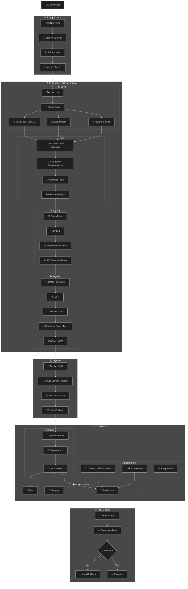

 

*MLOps Pipeline*

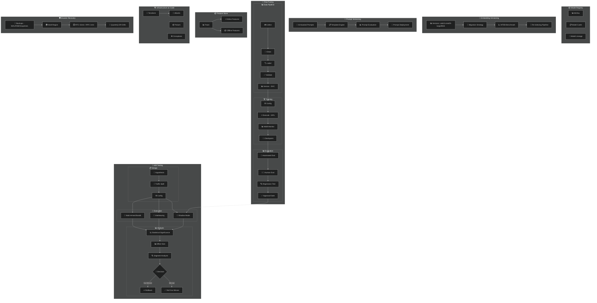

---

 

## 📊 Architecture Summary

| Metric | Count |
|--------|-------|
| **Total Diagrams** | 12 across 10 volumes |
| **Total Components** | 350+ |
| **Microservices** | 25+ |
| **Kafka Topics** | 20+ |
| **Database Systems** | 6: PostgreSQL, Redis, Qdrant, Elasticsearch, Neo4j, S3 |
| **AI/ML Models** | 15+: LLMs, Embedding, Reranker, Classifier |
| **Security Layers** | 8+: OAuth, JWT, RBAC, ABAC, OPA, RLS, Vault, Guardrails |
| **Monitoring Tools** | 10+: Prometheus, Grafana, Loki, Tempo, Jaeger, OpenTelemetry |
| **Evaluation Frameworks** | 3: RAGAS, DeepEval, LLM-as-Judge |
| **Deployment Strategies** | 3: Canary, Blue-Green, Progressive |

---

## 🏗️ Technology Stack

| Layer | Technologies |
|-------|-------------|
| **Frontend** | React, Next.js 14, React Native |
| **API Gateway** | Kong, Spring Cloud Gateway |
| **Backend** | Spring Boot 3.x, Java 21, Python 3.12 |
| **Service Mesh** | Istio, Envoy |
| **Message Broker** | Apache Kafka, Schema Registry |
| **Databases** | PostgreSQL 16, Redis 7, Qdrant, Elasticsearch 8, Neo4j |
| **Object Storage** | AWS S3, MinIO |
| **AI/LLM** | GPT-4o, Claude 3.5, Gemini 1.5, Llama 3.1, Mistral |
| **Embeddings** | text-embedding-3-large, BGE-M3, E5, ColBERTv2 |
| **Agentic Framework** | LangGraph, LangChain |
| **Auth** | Keycloak, OAuth2/OIDC, OPA |
| **Secrets** | HashiCorp Vault |
| **Container Orchestration** | Kubernetes EKS/GKE/AKS, Helm |
| **CI/CD** | GitHub Actions, ArgoCD, Argo Rollouts |
| **Observability** | Prometheus, Grafana, Loki, Tempo, Jaeger, OpenTelemetry |
| **Evaluation** | RAGAS, DeepEval, TruLens, MLflow |
| **IaC** | Terraform, Crossplane |
| **Security Scanning** | SonarQube, Semgrep, Trivy, Snyk |

---

### 🔗 Cross-Volume References

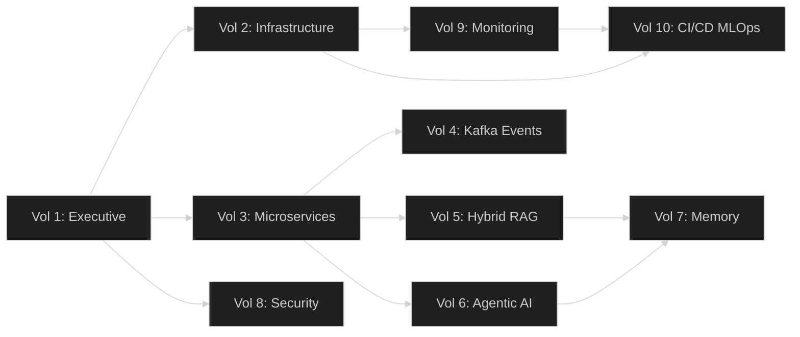

---

**Built with ❤️ for Enterprise Architecture**

*This document follows C4-inspired notation for clarity and maintainability at scale.*

